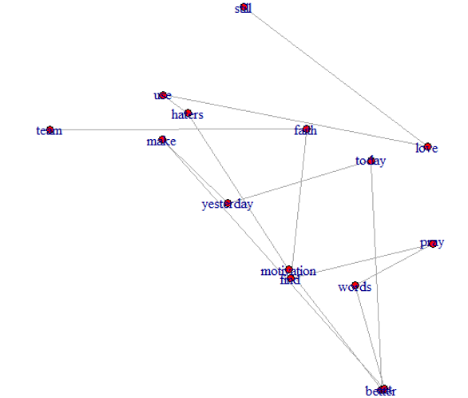

# Classification and clustering documents

Имя файла       | Содержимое файла
----------------|----------------------
data.json       | Коллекция документов
source.R        | Исходный код
report.pdf      | Результаты

Исходная коллекция данных представляет собой данные о пользователях социальной сети Twitter, которые включают в себя информацию и описание профилей, а также одну из последних публикаций и информацию о ней для каждого из пользователей. Полнотекстовые данные, а именно поле text, в котором содержится текст публикации, считается содержимым документа, а прочие собранные сведения – метаданными. 

+ Реализовано представление исходной коллекции в вероятностной, векторной и графовой моделях
+ Проведение классификации документов коллекции, заданной в графовой модели
+ Оценка качества классификации
+ Проведение кластеризации документов коллекции, заданной в графовой модели
+ Оценка качества кластеризации 

## Doc in graph model

